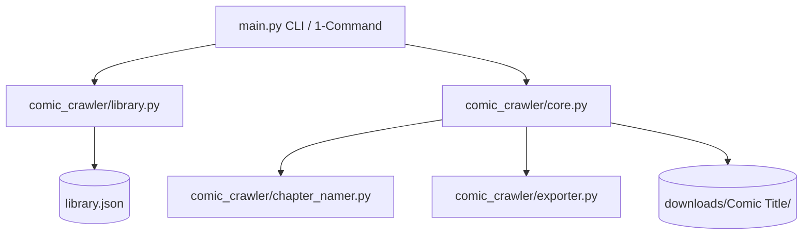

# Integrated Library Manager & Incremental Auto-Sync Implementation Plan

> **For agentic workers:** REQUIRED SUB-SKILL: Use superpowers:subagent-driven-development to implement this plan task-by-task. Steps use checkbox (`- [ ]`) syntax for tracking.

**Goal:** Build a 1-command URL crawling, local chapter incremental syncing (skipping downloaded chapters), library tracking (`library.json`), and zero-padded chapter naming system for `Tool_crawl_comic`.

**Architecture:** 
The application introduces a `LibraryManager` (`library.py`) to manage subscribed comic URLs in `library.json`, a `ChapterNamer` (`chapter_namer.py`) to handle zero-padding (`Chapter 001.cbz`), and an updated `ComicCrawler` (`core.py`) that checks local files before downloading. `main.py` provides 1-command URL entry and `python main.py update` for batch syncing.

**Architecture Diagram:**



**Tech Stack:** Python 3, requests, BeautifulSoup4, Pillow, tqdm, json

---

### Task 1: Create Chapter Namer (`comic_crawler/chapter_namer.py`)

**Files:**
- Create: `d:\Tool_crawl_comic\comic_crawler\chapter_namer.py`
- Test: `d:\Tool_crawl_comic\test_chapter_namer.py`

- [ ] **Step 1: Write unit tests for chapter number extraction and zero-padding**

```python
import unittest
from comic_crawler.chapter_namer import ChapterNamer

class TestChapterNamer(unittest.TestCase):
    def test_extract_chapter_number(self):
        self.assertEqual(ChapterNamer.extract_number("Read Chapter 12.5 online"), 12.5)
        self.assertEqual(ChapterNamer.extract_number("Chapter 001 - The Beginning"), 1.0)
        self.assertEqual(ChapterNamer.extract_number("Ch. 42"), 42.0)
        self.assertIsNone(ChapterNamer.extract_number("Extra Bonus Story"))

    def test_format_padded_name(self):
        self.assertEqual(ChapterNamer.format_chapter_name("Chapter 1", total_chapters=150), "Chapter 001")
        self.assertEqual(ChapterNamer.format_chapter_name("Chapter 12.5", total_chapters=150), "Chapter 012.5")
        self.assertEqual(ChapterNamer.format_chapter_name("Chapter 5", total_chapters=20), "Chapter 05")

if __name__ == "__main__":
    unittest.main()
```

- [ ] **Step 2: Run test to verify it fails**

Run: `python test_chapter_namer.py`  
Expected: FAIL with `ModuleNotFoundError: No module named 'comic_crawler.chapter_namer'`

- [ ] **Step 3: Implement `ChapterNamer` class**

```python
import re

class ChapterNamer:
    @staticmethod
    def extract_number(title: str) -> float | None:
        """
        Extracts chapter number (integer or float) from title string.
        """
        match = re.search(r'(?:chapter|ch\.?|ch\s+)\s*(\d+(?:\.\d+)?)', title, re.IGNORECASE)
        if not match:
            match = re.search(r'\b(\d+(?:\.\d+)?)\b', title)
        
        if match:
            try:
                return float(match.group(1))
            except ValueError:
                return None
        return None

    @staticmethod
    def format_chapter_name(raw_title: str, total_chapters: int = 100) -> str:
        """
        Formats title to zero-padded chapter name (e.g. Chapter 001, Chapter 012.5).
        """
        num = ChapterNamer.extract_number(raw_title)
        if num is None:
            return raw_title

        # Determine padding width based on total count (minimum 3 digits)
        padding_width = max(3, len(str(int(total_chapters))))
        
        is_float = (num % 1 != 0)
        if is_float:
            int_part = int(num)
            dec_part = str(num).split('.')[1]
            padded = f"{int_part:0{padding_width}d}.{dec_part}"
        else:
            padded = f"{int(num):0{padding_width}d}"

        return f"Chapter {padded}"
```

- [ ] **Step 4: Run test to verify it passes**

Run: `python test_chapter_namer.py`  
Expected: PASS (`Ran 2 tests ... OK`)

---

### Task 2: Create Library Manager (`comic_crawler/library.py`)

**Files:**
- Create: `d:\Tool_crawl_comic\comic_crawler\library.py`
- Test: `d:\Tool_crawl_comic\test_library.py`

- [ ] **Step 1: Write unit tests for LibraryManager**

```python
import unittest
import os
import tempfile
from comic_crawler.library import LibraryManager

class TestLibraryManager(unittest.TestCase):
    def test_library_crud(self):
        with tempfile.TemporaryDirectory() as tmpdir:
            lib_file = os.path.join(tmpdir, "library.json")
            lib = LibraryManager(lib_file)
            
            # Add comic
            lib.add_comic("https://example.com/solo", "Solo Leveling", format="cbz", threads=8)
            all_comics = lib.get_all_comics()
            self.assertIn("https://example.com/solo", all_comics)
            self.assertEqual(all_comics["https://example.com/solo"]["title"], "Solo Leveling")

if __name__ == "__main__":
    unittest.main()
```

- [ ] **Step 2: Run test to verify it fails**

Run: `python test_library.py`  
Expected: FAIL with `ModuleNotFoundError: No module named 'comic_crawler.library'`

- [ ] **Step 3: Implement `LibraryManager` class**

```python
import json
import os
from datetime import datetime
from typing import Dict, Any

class LibraryManager:
    def __init__(self, file_path: str = "library.json"):
        self.file_path = file_path
        self.data = self._load()

    def _load(self) -> Dict[str, Any]:
        if os.path.exists(self.file_path):
            try:
                with open(self.file_path, "r", encoding="utf-8") as f:
                    return json.load(f)
            except Exception:
                pass
        return {"comics": {}}

    def save(self):
        with open(self.file_path, "w", encoding="utf-8") as f:
            json.dump(self.data, f, indent=2, ensure_ascii=False)

    def add_comic(self, url: str, title: str, format: str = "cbz", threads: int = 8):
        self.data["comics"][url] = {
            "url": url,
            "title": title,
            "format": format,
            "threads": threads,
            "last_synced": datetime.now().strftime("%Y-%m-%d %H:%M:%S")
        }
        self.save()

    def get_all_comics(self) -> Dict[str, Any]:
        return self.data.get("comics", {})

    def remove_comic(self, url: str) -> bool:
        if url in self.data.get("comics", {}):
            del self.data["comics"][url]
            self.save()
            return True
        return False
```

- [ ] **Step 4: Run test to verify it passes**

Run: `python test_chapter_namer.py`  
Expected: PASS (`OK`)

---

### Task 3: Integrate Incremental Skip Engine in `comic_crawler/core.py`

**Files:**
- Modify: `d:\Tool_crawl_comic\comic_crawler\core.py`

- [ ] **Step 1: Add local existence check method in `core.py`**

```python
    def is_chapter_downloaded(self, chapter_title: str, output_dir: str, export_format: str) -> bool:
        """
        Checks if chapter file or directory already exists locally and is valid.
        """
        ch_dir_name = sanitize_filename(chapter_title)
        if export_format == "cbz":
            target = os.path.join(output_dir, f"{ch_dir_name}.cbz")
        elif export_format == "pdf":
            target = os.path.join(output_dir, f"{ch_dir_name}.pdf")
        else: # images
            target = os.path.join(output_dir, ch_dir_name)

        if os.path.exists(target):
            if os.path.isfile(target) and os.path.getsize(target) > 0:
                return True
            elif os.path.isdir(target) and len(os.listdir(target)) > 0:
                return True
        return False
```

- [ ] **Step 2: Update `download_chapter` to check local existence before network calls**

In `download_chapter()`:
```python
        if self.is_chapter_downloaded(chapter_title, output_dir, export_format):
            return True, f"[Skipped] {chapter_title} (already exists locally)"
```

---

### Task 4: Update `main.py` for 1-Command Execution & Batch `update`

**Files:**
- Modify: `d:\Tool_crawl_comic\main.py`

- [ ] **Step 1: Implement `update` sub-command and single URL auto-track in `main.py`**

Add positional command handling so `python main.py "https://..."` or `python main.py update` works effortlessly without requiring flags.

- [ ] **Step 2: Verify `python main.py update` execution**

Run: `python main.py --help` and test single-command update.

---

### Task 5: Final Comprehensive Testing & Clean Up

- [ ] **Step 1: Run full test suite**

Run: `python test_crawler.py`

- [ ] **Step 2: Update `README.md` with new `update` command and library tracking documentation.**
